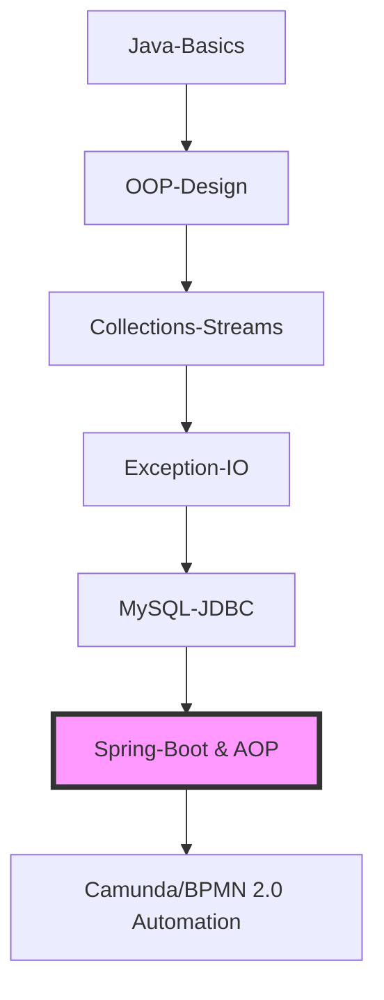

# 🛡️ RegTech Strategy Engine: Compliance-as-Code

 
 
 
 
 

## 🚀 Vision: Bridging the Regulatory Gap
In modern multinational corporations (MNCs), the friction between **Legal Requirements** and **Technical Implementation** is a major operational bottleneck. This project serves as a **Modular Compliance Engine** designed to translate complex statutes (GDPR, PIPL, BGB) into hard-coded systemic constraints within the Software Development Life Cycle (SDLC).

---

## 🛠️ Core RegTech Architecture

### 1. Compliance Logic Decoupling (Strategy Pattern)
* **Problem:** Hard-coding regulatory rules leads to system fragility when laws change.
* **Solution:** Implemented a **Strategy-based Rule Engine**. By decoupling "Execution Logic" from "Compliance Rules," the system supports real-time adjustments of thresholds (e.g., Data Retention limits, AML trigger amounts) via configuration without recompiling the source code.
* **Value:** Ensures **Zero-Downtime Compliance Updates** in response to sudden legislative shifts.

### 2. Dependency Injection & Scalability
* **Mechanism:** Leveraged **Spring Boot IoC/DI** to treat legal clauses as independent, pluggable components (`@Component`).
* **Feature:** Automatically detects and loads regional specific modules (e.g., a "PIPL-specific" checker vs. a "GDPR-specific" checker) based on the data's geographic origin.

### 3. Automated Audit Trail (AOP)
* **Logic:** Integrated **AOP (Aspect-Oriented Programming)** for non-intrusive audit logging via Method Instrumentation.
* **Defense:** Implemented **Fail-Fast interceptors** to terminate non-compliant transactions before data persistence.

---

## 💼 Domain Expertise & Professional Background

| Attribute | Detail |
| :--- | :--- |
| **Legal Status** | **PRC Legal Professional Qualification (Category A)** |
| **Experience** | 5+ Years in MNC Compliance (Kyowa Kirin, Decathlon) |
| **Language** | **German (PGH-8/C1)** | English (IELTS 7.0) | Chinese (Native) |
| **Education** | Tongji University (LL.M Candidate) \| Heidelberg University (Visiting) |

## 📈 Java & Compliance Journey (Log)

每一天都要有真实进步。这部分记录了我从法务转型法律工程师的底层技术积累。

🔥 **Current Streak**: Day 104 
📦 **Total Commits**: 117+  

  
📜 <b>View Full Learning Archive (Day 1 - Day 105)</b>

  
| Day | Date | Topic | Status | Notes |
|:---:|:---:|---|:---:|---|
| Day1 | 11/27 | OOP Basics | ✔ | Classes & Objects |
| Day2 | 11/28 | Lesson 53 Notes | ✔ | Committed notes |
| Day3 | 11/29 | Encapsulation | ✔ | Getter/Setter |
| Day4 | 12/01 | LeetCode - FizzBuzz (LC412) | ✔ | Created LeetCode/ folder |
| Day5 | 12/02 | Operators Review | ✔ | Logical / Relational / Ternary |
| Day6 | 12/03 | switch Statement | ✔ | Basic + Arrow Syntax |
| Day7 | 12/04 | Mini Project — Healthy BMI | ✔ | HeimaHealthy.java initial version |
| Day8 | 12/05 | Refactored BMI (Logic decoupling)（黑马01） | ✔ | Improved structure |
| Day9 | 12/06 | LeetCode - Roman to Integer (LC013) | ✔ | Solved independently |
| Day10 | 12/07 | 封装优化 BMI | ✔ | Extracted methods |
| Day11 | 12/08 | 输入封装 + switch 优化 | ✔ | readValue 方法 |
| Day12 | 12/09 | 方法声明与调用 + 数组基础 | ✔ | return vs void、数组初始化三种写法 |
| Day13 | 12/10 | 数组遍历（while）+ 可变参数 | ✔ | while 遍历数组、字符串拼接成 [1,2,3]、varargs 本质为数组 |
| Day14 | 12/11 | 构造方法 + 对象创建流程 | ✔ | 构造方法作用、this、return执行流、对象赋值过程 |
| Day15 | 12/12 | 继承（extends）+ 方法复写（重写 override） | ✔ | 父类/子类结构、方法重写规则、super 的使用 |
| Day16 | 12/13 | 多态（Polymorphism） | ✔ | 向上转型、方法动态绑定、instanceof + 向下转型（类型转换） |
| Day17 | 12/14 | 面向对象：降低耦合（Travel Mode） | ✔ | 视频学习为主，理解抽象与多态降低耦合 |
| Day18 | 12/15 | 面向對象：父類構造方法(Travel Mode) | ✔ | super 调用、构造器链、父类先初始化原则 |
| Day19 | 12/16 | Travel Mode | ✔ | 無代碼產出，為後續學習保持精力 |
| Day20 | 12/17 | 面向對象：權限修飾符(Travel Mode) | ✔ | private / protected / public 可见性范围，强化封装与继承边界 |
| Day21 | 12/18 | Travel Mode | ✔ | 無代碼產出，為後續學習保持精力 |
| Day22 | 12/19 | Travel Mode | ✔ | 返程休息日，调整状态，准备恢复正常学习节奏 |
| Day23 | 12/20 | 面向对象复盘：Product 设计 | ✔ | 回顾继承、多态与构造器链，反思设计扩展性 |
| Day24 | 12/21 | 面向对象：工具类（Utility Class） | ✔ | static 方法复用、私有构造防实例化；角度↔弧度转换示例（未写代码） |
| Day25 | 12/22 | 面向对象综合案例：用户注册/登录 | ✔ | 需求分析→模型设计→DAO→Service→UI，理解分层架构与低耦合设计 |
| Day26 | 12/23 | 用户系统案例：解耦重构 | ✔ | extract 重构与主流程调整，梳理层间依赖与调用链 |
| Day27 | 12/24 | Overriding Object.equals | ✔ | Overrode `equals` method to compare `Person` objects by `name` and `age` |
| Day28 | 12/25 | Object.equals Consolidation | ✔ | Reinforced equals semantics: reference vs value equality, type check + cast workflow, and common pitfalls (== vs equals) |
| Day29 | 12/26 | Overriding hashCode with equals | ✔ | Implemented `hashCode()` consistent with `equals()` using `Objects.hash`, verified behavior via a small demo |
| Day30 | 12/27 | Scanner 输入处理复盘 | ✔ | Rewrote Scanner demo for int/double input; fixed variable shadowing issue, clarified type boundaries, and identified misuse of instanceof for primitive input validation |
| Day31 | 12/28 | Overriding toString() | ✔ | Learned Object.toString() semantics, created ToStringDemo, and overrode toString() in Person for readable output |
| Day32 | 12/29 | Collections: Collection API + List vs Set | ✔ | Practiced core Collection methods (add/size/remove/isEmpty/clear/contains/toArray) and understood key differences between List and Set; skipped advanced toArray(String[]::new) for now |
| Day33 | 12/30 | Rest Day | ✔ | No Java coding; took a planned rest day to recover before next learning cycle |
| Day34 | 12/31 | Collections: 3 traversal methods | ✔ | Practiced iterating a Collection via Iterator, enhanced for-loop, and Lambda `forEach`; briefly introduced method reference `::` (not fully digested yet) |
| Day35 | 01/01 | ConcurrentModificationException & Traversal Differences | ✔ | Understood fail-fast behavior during iteration; compared Iterator / enhanced for / Lambda forEach; learned safe removal via Iterator.remove() |
| Day36 | 01/02 | List traversal & safe removal | ✔ | Implemented reverse index removal and iterator removal for Integer and String lists; debugged remove(int) vs remove(Object) issues |
| Day37 | 01/03 | List-specific operations | ✔ | Practiced List core methods (add with index, remove by index, set, get); reinforced understanding of index-based access and return values |
| Day38 | 01/04 | ArrayList & LinkedList internals; LinkedList queue/stack demo | ✔ | Learned ArrayList and LinkedList internal principles; implemented and uploaded LinkedList demos using FIFO (addLast/removeFirst) and LIFO (push/pop) |
| Day39 | 01/05 | ArrayList movie management system (CRUD, console-based) | ✔ | Followed tutorial for structure; completed CRUD logic and fixed removal loop (i--) to avoid skipping; added query-by-name helper and update flow; implemented add, remove, update, query and list operations |
| Day40 | 01/06 | Set overview: HashSet, LinkedHashSet, TreeSet | ✔ | Learned Set collection characteristics (no duplicates, no index); compared HashSet (unordered), LinkedHashSet (insertion-order), and TreeSet (sorted, natural ordering) |
| Day41 | 01/07 | Set internals & custom object deduplication | ✔ | Learned HashSet底层原理；implemented custom object de-duplication via overriding equals() and hashCode() in Student |
| Day42 | 01/08 | Rest Day | ✔ | No Java study today; paused for recovery and schedule adjustment |
| Day43 | 01/09 | LinkedHashSet, TreeSet & Map basics | ✔ | Learned Set variants (LinkedHashSet, TreeSet) and started Map system overview; practiced core Map methods with HashMap demo |
| Day44 | 01/10 | Review of Basics codebase | ✔ | Reviewed and re-understood previously written Java basics code (arrays, methods, scanner, varargs, control flow); clarified earlier misconceptions through rereading own implementations |
| Day45 | 01/11 | Review of OOP codebase | ✔ | Reviewed and re-understood previously written OOP code (inheritance, constructors, override, polymorphism); reviewed inheritance and polymorphism implementations; clarified design-level questions around super calls, override necessity, and method semantics |
| Day46 | 01/12 | Map Traversal + Voting Mini Project | ✔ | Practiced Map traversal via keySet, entrySet, and forEach (Lambda); implemented a scenic spot voting demo with manual input, then optimized using Random; refactored to simplified counting logic and resolved syntax errors caused by misplaced braces |
| Day47 | 01/13 | Map Implementations & Stream API Basics | ✔ | Learned Map implementation classes and the Set–Map correspondence (conceptual); practiced Stream creation and basic pipeline usage; explored common intermediate operations through stream demos (filter, map, limit, distinct) |
| Day48 | 01/14 | Stream Terminal Operations | ✔ | Learned and practiced common Stream terminal operations (forEach, count, collect, toArray); completed StreamDemo4 to understand how streams produce final results and how terminal operations trigger execution |
| Day49 | 01/15 | Prerequisites: Varargs & Collections Utility | ✔ | Reviewed prerequisite concepts including varargs (int... args) semantics and the Collections utility class; clarified usage scenarios and common patterns as preparation for deeper Collection and Stream usage |
| Day50 | 01/16 | Collections review: List & Set | ✔ | Reviewed core Collection concepts with focus on List and Set; consolidated differences in structure, ordering, duplication rules, traversal methods, and typical usage scenarios |
| Day51 | 01/17 | File & IO overview | ✔ | Learned basic usage of File for file/directory operations and gained an overview of Java IO streams for reading and writing files; focused on conceptual understanding rather than hands-on coding |
| Day52 | 01/18 | Dou Dizhu demo (OOP + Collections) | ✔ | Built a simplified Dou Dizhu game demo using OOP design; defined Card and Room classes, generated a 54-card deck with suits and ranks, shuffled with Collections.shuffle, dealt cards with bottom cards reserved for the landlord, and sorted each hand using Collections.sort |
| Day53 | 01/19 | File API basics & directory traversal | ✔ | Learned File class basics including file creation and deletion; practiced traversing first-level directories and handling different file scenarios using File APIs |
| Day54 | 01/20 | Rest Day (Health Recovery) | ✔ | Took a full rest day due to illness; no Java study today, prioritized physical recovery to maintain long-term learning continuity |
| Day55 | 01/21 | Recursion Basics & Infinite Recursion | ✔ | Learned the concept of recursion, basic recursive structure (method self-call + termination condition), and understood causes and risks of infinite recursion through examples |
| Day56 | 01/22 | Recursion Practice: Factorial & Sum | ✔ | Practiced recursion by implementing factorial calculation and sum from 1 to n; reinforced recursive structure and termination conditions through hands-on coding |
| Day57 | 01/23 | Rest Day | ✔ | No Java study today; took a rest day to recover and maintain learning sustainability |
| Day59 | 01/24 | Rest Day | ✔ | No Java study today due to personal schedule; maintained continuity in the learning log |
| Day60 | 01/25 | Rest Day | ✔ | No Java study today due to personal schedule; learning log kept up to date |
| Day61 | 01/26 | Method Recursion & File IO | ✔ | Finished Monkey Peach problem and recursive file search (qq.exe) |
| Day62 | 01/27 | Rest Day | ✔ | Recovering from illness; prioritized health over coding |
| Day63 | 01/28 | Rest Day | ✔ | Recovering from illness (Flu) |
| Day64 | 01/29 | Rest Day | ✔ | Prioritized health over coding |
| Day65 | 01/30 | Friend's Wedding | ✔ | Out of town for wedding ceremony |
| Day66 | 01/31 | Friend's Wedding | ✔ | Traveling back to Shanghai |
| Day67 | 02/01 | Character Sets & Encoding | ✔ | Mastered ASCII, GBK, UTF-8 logic |
| Day68 | 02/02 | Charset Encoding & Decoding | ✔ | Handled manual conversion in Java |
| Day69 | 02/03 | Intro to IO Streams | ✔ | Classification: Byte vs. Character |
| Day70 | 02/04 | Rest Day | ✔ | Health recovery & energy saving |
| Day71 | 02/05 | FileInputStream | ✔ | Reading local data streams |
| Day72 | 02/06 | FileOutputStream | ✔ | Writing data & Appending mode |
| Day73 | 02/07 | IO Copy & Resource Mgmt | ✔ | Mastery of try-with-resources |
| Day74 | 02/08 | Reflection & Annotations | ✔ | Reflection for Audit; Annotations for Masking |
| Day75 | 02/09 | Dynamic Proxy | ✔ | Implemented Proxy pattern; understood InvocationHandler |
| Day76 | 02/10 | Advanced Dynamic Proxy & Generics | ✔ | Applied Generics to ProxyUtil for universal method intercepting; felt the beauty of code abstraction |
| Day77 | 02/11 | Exception Handling & Enums | ✔ | Mastered Custom Exceptions and Enums for compliance logic implementation |
| Day78 | 02/12 | Intro to Spring Boot | ✔ | Overview of Spring Boot; understood its role as a "productivity multiplier" |
| Day79 | 02/13 | Java Break | ✔ | Java on pause for recovery |
| Day80 | 02/14 | Spring Boot & Maven Environment | ✔ | Rescued C drive; Fixed Maven NUL bug; First Hello World API running |
| Day81 | 02/15 | Maven Standardization & Git Workflow | ✔ | Migrated to standard project structure; Refined Maven/Git configurations |
| Day 82 | 02/16 | Lunar New Year's Eve | 🏮 | System Idle for CNY; Scheduled Maintenance & Family Reunion |
| Day 83 | 02/17 | Spring Boot Logic & Configuration | ✔ | Implemented Legal Logic APIs; Mastered properties vs. YAML configuration |
| Day 84 | 02/18 | Scheduled Downtime | ✔ | System idle for recovery; Pre-configured for properties/yaml deep dive |
| Day 85 | 02/19 | YAML Syntax & Configuration Retrieval | ✔ | Mastered YAML list/array structures and @Value/@ConfigurationProperties |
| Day 86 | 02/20 | JDBC & Database Persistence | ✔ | Mastered JDBC 7-step workflow, PreparedStatement, and Result-to-Object mapping, Finalized 'src' hierarchy for persistence layer; Established project-wide coding standards |
| Day 87 | 02/21 | Spring Boot Integration: MyBatis & Bean Lifecycle | ✔ | Integrated MyBatis; Mastered @Mapper & Component Scanning |
| Day 88 | 02/22 | Spring Boot: Configuration & Conditional Injection | ✔ | Mastered @Configuration, @Bean, @Import & Advanced Conditionals (@OnProperty, @OnClass, @OnMissingBean) |
| Day 89 | 02/23 | Spring Boot: Compliance Strategy & Exception Architecture | ✔ | Integrated multi-region strategies with custom fail-fast exceptions |
| Day 90 | 02/24 | Professional Profile Optimization | ✔ | Refined IT Resume |
| Day 91 | 02/25 | Java 10-17 Features & Stream API Enhancements | ✔ | Applied Sealed Classes, Text Blocks, Var, and takeWhile/dropWhile |
| Day 92 | 02/26 | Java Core: OOP Mechanisms & Polymorphism | ✔ | Mastered Method Overloading, Access Control, Type Casting, and Field Hiding |
| Day 93 | 02/27 | SQL Fundamentals & Relational Database Logic | ✔ | Mastered DDL/DML operations and foundational query structures |
| Day 94 | 02/28 | LeetCode SQL Practice: Data Transformation & Constraints | ✔ | Solved 8 problems including Joins, Data Cleansing, and Schema Updates |
| Day 95 | 03/01 | SQL: Aggregation & Multi-table Relational Queries | ✔ | Mastered Group By, Joins, and Null-conditional filtering via LeetCode |
| Day 96 | 03/02 | Unit Testing: JUnit 5 & Mockito Foundations | ✔ | Implemented data masking logic with Parameterized Tests and Mockito integration |
| Day 97 | 03/03 | Compliance Automation: KIE-CI & Web Interceptors | ✔ | Integrated KIE-CI with HandlerInterceptor for dynamic GDPR consent validation |
| Day 98 | 03/04 | Rules Engine: Drools Integration & Compliance Logic | ✔ | Successfully integrated Drools (KIE) to decouple GDPR business rules |
| Day 99 | 03/05 | Compliance Engineering: AML Check Utility | ✔ | Implemented Anti-Money Laundering (AML) component with JUnit assertFalse validation |
| Day 100 | 03/06 | Spring AOP & Audit Logging: Method Instrumentation | ✔ | Implemented AOP-based audit logging with JoinPoint metadata and SLF4J |
| Day 101 | 03/07 | Knowledge Consolidation & System Maintenance | ✔ | Mental recharge and technical review for the next project phase |
| Day 102 | 03/08 | Personal Management & Environmental Optimization | ✔ | Handled administrative tasks to ensure a stable development environment |
| Day 103 | 03/09 | Architectural Design: Legal-to-Code Constraint Mapping | ✔ | Formalized system constraints based on regulatory logic and hard-coding rules |
| Day 104 | 03/10 | RegTech Framework: Modular AML Engine & AOP Instrumentation | ✔ | Built scalable AML module with Strategy-based rules and performance tracking |

  

### 🗓️ Recent Progress (Advanced Backend)
| Day | Date | Topic | Status | Key Achievement |
|:---:|:---:|---|:---:|---|
| Day 104 | 03/10 | RegTech Framework | ✔ | **Built scalable AML module with Strategy-based rules** |
| Day 103 | 03/09 | Architectural Design | ✔ | Formalized Legal-to-Code Constraint Mapping |
| Day 100 | 03/06 | Spring AOP | ✔ | Implemented AOP-based audit logging with SLF4J |
| Day 98 | 03/04 | Rules Engine | ✔ | Successfully integrated Drools (KIE) for GDPR rules |
| Day 89 | 02/23 | Spring Boot | ✔ | Integrated multi-region strategies & custom exceptions |
| Day 86 | 02/20 | JDBC & Persistence | ✔ | PreparedStatement & ORM Foundations |
| Day 75 | 02/09 | Dynamic Proxy | ✔ | Implemented Proxy pattern for method interception |

## 📂 Project Structure & Quick Links
* **[📁 Core RegTech Engine (Java/Spring Boot)](./code/regtech)**: The primary logic for automated auditing and regulatory rules.
* **[📂 Java Basics Archive](./code/basics)**: Foundational exercises (BMI Calculator, OOP patterns).
* **[📂 LeetCode Solutions](./LeetCode)**: Algorithmic problem solving.

  
🔍 <b>Day 81 Technical Journal: Standardization & Infrastructure</b> (Click to expand details)

> **"Compliance begins with structure."** > Today marked the transition from loose script management to professional industry-standard project architecture.

#### 1. Maven Project Standardization
* **Structural Refactoring**: Migrated all legacy source files into the standard Maven directory hierarchy (`src/main/java/com/wenjian/...`).
* **Dependency Management**: Successfully initialized `pom.xml` using **Java 17** and **Spring Boot 2.7**, aligning with LTS standards.
* **XML Proficiency**: Corrected syntax errors in `pom.xml` by adopting proper XML comment protocols (``).

#### 2. Version Control & Repository Governance
* **Artifact Filtering**: Implemented a robust `.gitignore` strategy to exclude build artifacts (`target/`) and IDE metadata (`.idea/`), maintaining a clean repository.
* **Git Workflow**: Mastered the manual deployment of complex Maven projects, ensuring only essential source code is versioned.

#### 3. Strategic Pathing
* Organized the repository into a hierarchical structure under `/code/projects/spring-study/`, mirroring logical separation in large-scale legal-tech deployments.

  
🔍 <b>Day 86 Technical Journal: Database Connectivity & Security Hardening </b> (Click to expand details)

> **​"Data persistence is the foundation of any reliable compliance system."** > Today bridged the gap between Java and MySQL, moving from hardcoded logic to dynamic data management.

#### 1. JDBC Standard Workflow (The 7 Steps)
* **​Driver Management**: Mastered explicit driver loading via Class.forName("com.mysql.cj.jdbc.Driver").
* **Connection Lifecycle**: Established secure sessions using standard URL protocols (jdbc:mysql://localhost:3306/db1).
* **Resource Governance**: Implemented "Outside-In" resource release patterns (ResultSet -> Statement -> Connection) to prevent memory leaks and connection exhaustion.

#### 2. Security & Performance (PreparedStatement)
* **​Anti-Injection Strategy**: Identified the vulnerabilities of Statement and fully transitioned to **PreparedStatement (Security Milestone)**.
* **Pre-compilation Benefits**: Understood how pre-compiled SQL enhances both system security and execution efficiency—a critical requirement for high-stakes LegalTech environments.

#### 3. Data Transformation (ORM Foundations)
* **​​Entity Modeling**: Developed the User POJO (Plain Old Java Object) to encapsulate database records.
* **Collection Mapping**: Implemented logic to traverse ResultSet and map rows into an ArrayList<User>, converting raw database tables into actionable Java objects.

#### 4. Debugging & Infrastructure
* **​CLI Proficiency**: Performed manual data verification and DML operations via MySQL command-line interface in custom D-drive directories.
* **Refined Execution**: Resolved critical logic errors regarding PreparedStatement parameter passing (Empty executeQuery() after pre-compilation).

#### 5. Engineering Standards Update
* **Legacy Strategy**: Archived `code/basics/` as functional syntax notes.
* **New Standard**: Committed all JDBC source files to `src/com/wenjian/jdbc/` to ensure package-path alignment. This marks the transition from "Syntax Learning" to "Enterprise-Level Engineering."

  
🔍 <b>Day 89 Technical Journal</b> (Click to expand details)

#### 1. Strategy Pattern & Conditional Configuration
* **Implementation**: Leveraged @ConditionalOnProperty to enable dynamic switching between GdprChecker and PiplChecker based on application.properties.
* **Environment Isolation**: Utilized Spring Profiles (application-cn.properties / application-eu.properties) to physically separate regional legal configurations, simulating a real-world multi-national compliance environment.

#### 2. Exception-Driven Compliance Architecture
* **Fail-Fast Princinple**: Refactored DataService to discard primitive boolean returns in favor of throwing a custom ComplianceViolationException.
* **Engineering Value**: This approach ensures "strong enforcement" of compliance rules. By throwing an exception, the business execution flow is immediately terminated, preventing non-compliant data from reaching the persistence layer or downstream services.

#### 3. Application Context Lifecycle Management
* **Bootstrap Standardization**: Corrected the execution sequence in LegalTechApplication. Business logic now executes only after SpringApplication.run() has fully refreshed the context and beans are retrieved via context.getBean().
* **Log Stream Synchronization**: Resolved the interleaving of System.out and Spring framework startup logs, ensuring that technical audit outputs are clear and sequential.

## 🎯 Roadmap (2026–2027)

​"Code is the new law. We ensure the law is executed correctly."  
​👩‍💻 Author: Wenjian Liu — one step a day
