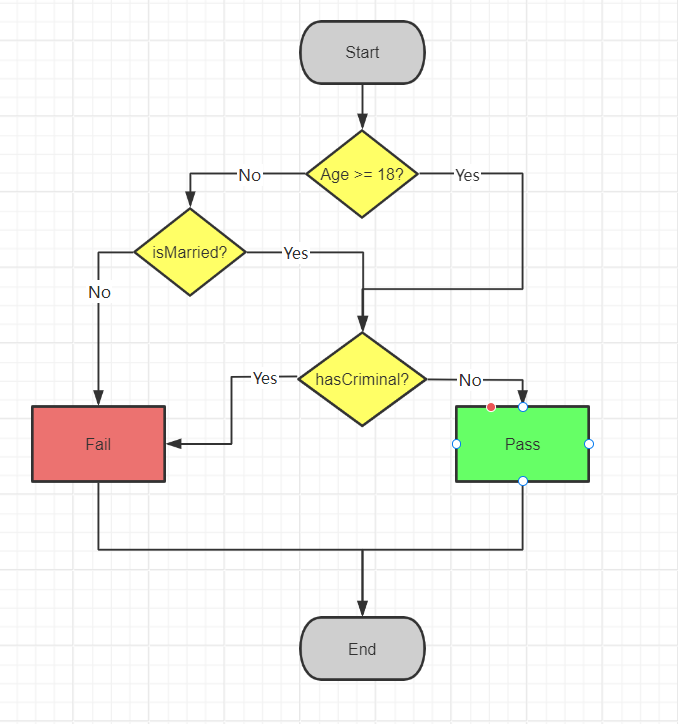

### 1. Visualizing the Eligibility Logic

To bridge the gap between abstract legal requirements and systemic constraints, I formalized process into a structured flowchart.

> **Note**: This diagram serves as the blueprint for the `BgbValidator.java` implementation.

### 2. Data Privacy Logic
This module handles the technical enforcement of the **Personal Information Protection Law (PIPL)** & **GDPR**, ensuring data processing meets regional compliance standards.

graph TD
    A[Start: Case Input] --> B{Eligibility Check}
    B -- Exception Exists --> C[Execute Strategy A]
    B -- Standard Case --> D[Execute Strategy B]
    C --> E[Generate JSON Audit Trail]
    D --> E
    E --> F[End: Result Output]
